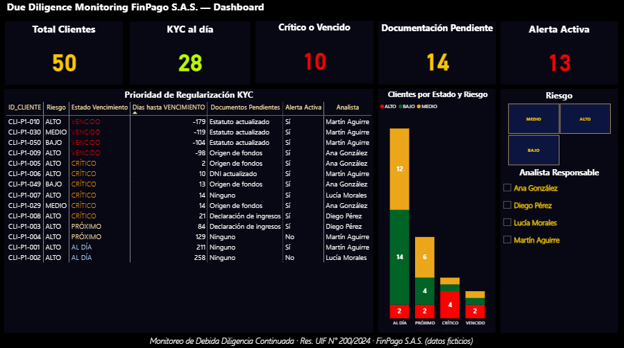
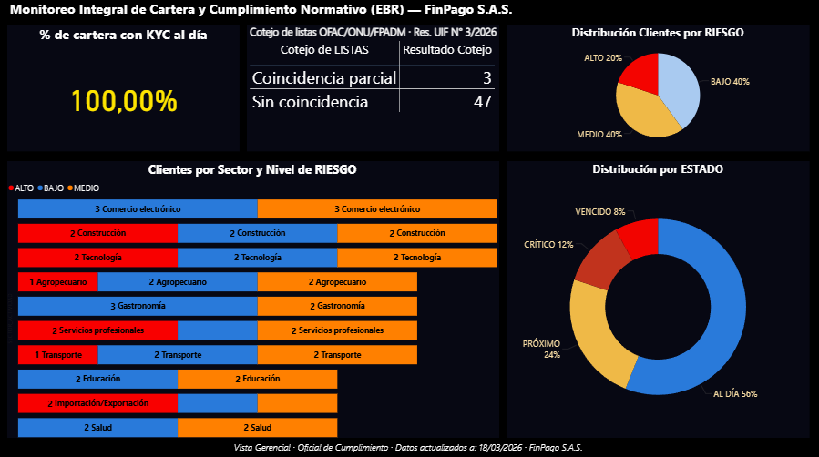
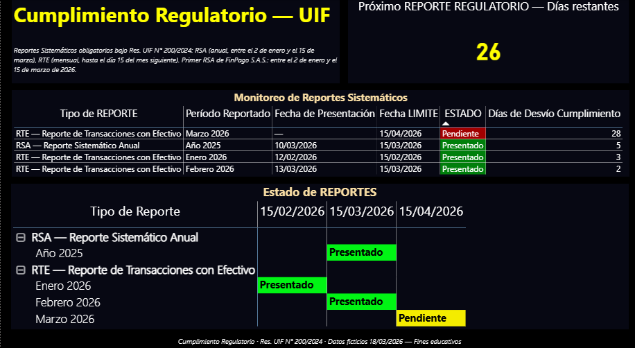

# Dashboard de Monitoreo de Cumplimiento KYC — FinPago S.A.S.

Dashboard de compliance KYC construido en Power BI para FinPago S.A.S., 
entidad ficticia que opera como PSPCP (billetera virtual) bajo la 
Res. UIF N° 200/2024. Proyecto 5 de un portfolio integrado de cuatro 
proyectos AML/KYC que cubre el ciclo completo del cliente bajo 
normativa argentina 2026.

---

## Tres niveles de usuario, tres páginas

| Nivel de usuario | Página del dashboard | Pregunta que responde |
|---|---|---|
| Analista Jr | Página 1 — Vista Operacional | ¿Qué clientes debo revisar hoy? |
| Oficial de Cumplimiento | Página 2 — Vista Gerencial | ¿Cuál es el estado de cumplimiento de nuestra cartera? |
| Gerencia / Auditoría | Página 3 — Cumplimiento Regulatorio | ¿Estamos al día con nuestras obligaciones ante la UIF? |

---

## Capturas del dashboard

### Página 1 — Vista Operacional (Analista Jr)


### Página 2 — Vista Gerencial (Oficial de Cumplimiento)


### Página 3 — Cumplimiento Regulatorio (Gerencia / Auditoría)


---

## Qué monitorea este dashboard

- **Debida Diligencia Continuada:** estado de vencimiento del legajo KYC de los 50 clientes de la cartera, con semáforo (AL DÍA / PRÓXIMO / CRÍTICO / VENCIDO) y cola de trabajo diaria para el analista.
- **Índice de Cumplimiento KYC:** porcentaje de la cartera con legajo al día, con umbrales Verde (≥80%) / Amarillo (60–79%) / Rojo (<60%).
- **Cotejo de listas FPADM:** estado del cotejo OFAC/ONU/FPADM por cliente bajo Res. UIF N° 3/2026.
- **Reportes Sistemáticos:** estado del RSA (Reporte Sistemático Anual) y RTE (Reporte de Transacciones con Efectivo) con fechas límite y días de desvío. Monitorea las obligaciones de reporting del propio sujeto obligado ante la UIF.

---

## Normativa aplicada

| Norma | Aplicación en el dashboard |
|---|---|
| Res. UIF N° 200/2024 | Marco principal: DDC, Perfil Transaccional, Monitoreo, Reportes Sistemáticos |
| Res. UIF N° 3/2026 | Cotejo de listas FPADM |
| Res. UIF N° 207/2025 | RFT — congelamiento de activos ante coincidencia confirmada |
| BCRA Com. "A" 7462/2022 | Trazabilidad de operaciones |

---

## Estructura del repositorio
```
kyc-dashboard-monitoreo-finpago/
├── README.md
├── DISCLAIMER.md
├── normativa/
│   └── corpus_normativo_p5.md
├── datos/
│   └── DATOS_MONITOREO_KYC_FINPAGO.xlsx
├── dashboard/
│   ├── dashboard_kyc_finpago.pbix
│   ├── pagina1_vista_operacional.png
│   ├── pagina2_vista_gerencial.png
│   └── pagina3_cumplimiento_regulatorio.png
├── especificacion/
│   └── especificacion_dashboard_kyc.pdf
└── infografia/
    └── dashboard_estructura_linkedin.png
```

---

## Conexión con el portfolio integrado de FinPago S.A.S.

Este proyecto forma parte de un caso de estudio cohesionado que cubre el ciclo completo del cliente AML/KYC:

| Proyecto | Qué cubre | Eslabón del ciclo |
|---|---|---|
| P1 — Matriz EBR | Clasificación de riesgo de la cartera | Conocimiento inicial del cliente |
| P2 — Onboarding KYC | Proceso de alta y verificación | Vinculación del cliente |
| P3 — Alertas y ROS | Análisis de operaciones y reporte | Monitoreo transaccional |
| P5 — Dashboard KYC | Monitoreo continuo del legajo y cumplimiento regulatorio | Gestión continua y reporting |

---

## Stack técnico

- **Microsoft Excel** — modelo de datos con 4 pestañas, 50 clientes simulados, fórmulas dinámicas (HOY(), VLOOKUP, IF anidados), formato condicional
- **Power BI Desktop** — dashboard de 3 páginas con medidas DAX, segmentadores y formato condicional
- **Normativa:** Res. UIF N° 200/2024, Res. UIF N° 3/2026, Res. UIF N° 207/2025, BCRA Com. A 7462/2022

---
## Autor

**[Joel Kraft]** · (https://www.linkedin.com/in/kraft-joel-analytics/)

---

>  Todos los datos son ficticios. Ver [DISCLAIMER.md](DISCLAIMER.md).
